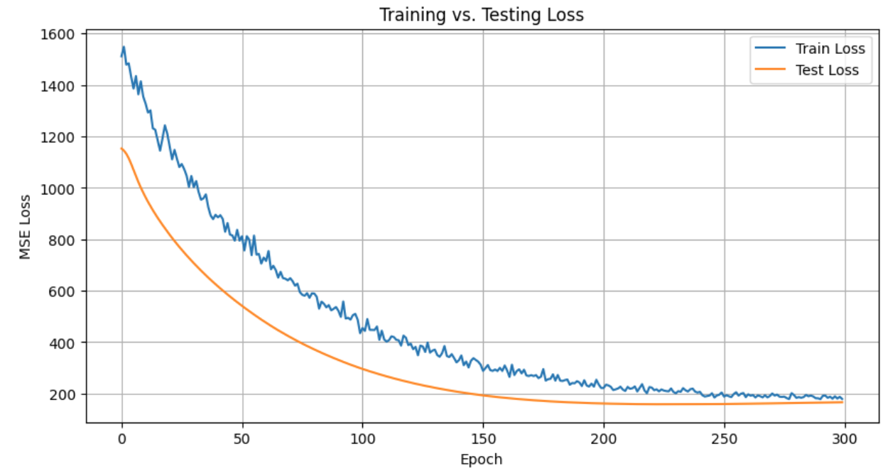

# 📌 Product Purchase Predictions: CNN+LSTM Multi-Output Demand Forecasting
> A deep learning pipeline that forecasts next-day purchase volumes for 43 products simultaneously using a CNN+LSTM architecture over lag and calendar features, built with PyTorch.

## 📖 Overview
 - This project implements a **multi-output time-series regression** pipeline that predicts next-day purchase demand for 43 products in a single forward pass.
 - Raw transaction data is consolidated into daily product totals, then enriched with **3-day lag features** and **calendar indicators** (month, day-of-week, weekend flag) to capture momentum and seasonality.
 - A sliding window of length 3 converts the feature table into `(batch, seq_len, features)` tensors; a **CNN+LSTM** model then applies 1D convolutions across feature channels to extract local patterns before an LSTM captures temporal dependencies.
 - The model outputs predictions for all 43 products simultaneously via a single fully-connected layer, trained with **MSE loss** and **Adam optimizer** over 300 epochs.
 - Evaluation is performed with **per-product MAE** across 33 held-out test sequences, providing SKU-level visibility into forecast quality.

## 🏢 Business Impact
Retailers and café operators must plan inventory, staffing, and promotions at the product level — yet traditional tabular models discard the temporal structure that drives daily purchasing behavior. This pipeline delivers simultaneous next-day demand forecasts for an entire product catalog in one inference call, enabling procurement teams to act on granular, time-aware predictions rather than category-level averages. By automating the full workflow from raw transaction logs to per-SKU forecasts, the system reduces manual intervention in demand planning and supports faster, data-driven replenishment decisions.

## 🚀 Features
✅ **Multi-Output Forecasting:** Predicts next-day purchase volumes for all 43 products in a single forward pass, eliminating the need to train one model per SKU.  
✅ **Temporal Feature Engineering:** Automatically generates 1-day, 2-day, and 3-day lag features for every product plus month, day-of-week, and weekend calendar indicators.  
✅ **Sequence Windowing:** Converts the flat feature table into fixed-length `(batch, seq_len=3, features=132)` tensors that preserve temporal ordering for the CNN+LSTM.  
✅ **CNN+LSTM Architecture:** Two stacked Conv1d layers extract cross-feature interactions before an LSTM with hidden size 64 captures sequence-level temporal dynamics.  
✅ **GPU-Ready Training:** Seamless CPU/GPU execution via PyTorch `.to(device)`, with a clean 300-epoch training loop and per-epoch train/test loss logging.  
✅ **Per-Product MAE Evaluation:** Reports individual MAE for each of the 43 products, giving granular visibility into which SKUs are easiest and hardest to forecast.  

## ⚙️ Tech Stack
| Technology        | Purpose                                                                    |
| ----------------- | -------------------------------------------------------------------------- |
| `Python`          | Primary language for the full pipeline                                     |
| `PyTorch`         | CNN+LSTM model definition, training loop, and DataLoader pipelines         |
| `pandas`          | Transaction data loading, product consolidation, daily aggregation, pivoting|
| `NumPy`           | Sequence windowing, array manipulation, and per-product metric computation |
| `scikit-learn`    | `MinMaxScaler` for feature normalization, `train_test_split`, `mean_absolute_error` |
| `matplotlib`      | Training vs. testing loss curve visualization                              |
| `Jupyter Notebook`| Interactive development and step-by-step workflow execution                |

## 📂 Project Structure
<pre>
📦 Product Purchase Predictions
 ┣ 📂 imgs
 ┃ ┗ 📜 training_testing_loss.png
 ┣ 📜 Product_Purchase_Predictions.ipynb
 ┣ 📜 LICENSE
 ┗ 📜 README.md
</pre>

## 🛠️ Installation

1️⃣ **Clone the Repository**
<pre>
git clone https://github.com/ahmedmoussa/ppp.git
cd ppp
</pre>

2️⃣ **Create and Activate a Virtual Environment**
<pre>
python -m venv venv
source venv/bin/activate
</pre>

3️⃣ **Install Dependencies**
<pre>
pip install pandas numpy scikit-learn torch matplotlib jupyter
</pre>

4️⃣ **Launch Jupyter Notebook**
<pre>
jupyter notebook Product_Purchase_Predictions.ipynb
</pre>

## 📂 Training vs. Testing Loss

### Training and Testing Loss Curve

  

## 📊 Results
 - **Task:** Multi-output regression forecasting next-day purchase volume for 43 products simultaneously from 178 daily observations.
 - **Dataset:** 132 input features (3-day lags × 43 products + 3 calendar features); 80/20 train/test split yielding 139 training and 33 test sequences.
 - **Model convergence:** CNN+LSTM trained for 300 epochs with MSE loss; train and test loss curves show consistent convergence with no divergence.
 - **Per-product MAE:** Ranges from 0.66 to 24.02 across 43 products, with a mean MAE of approximately 9.51 units per day; low-volume products achieve sub-2-unit MAE while high-volume SKUs account for the upper range.
 - **Evaluation artifact:** Training vs. testing loss curve saved to `imgs/training_testing_loss.png` confirming model generalization.

## 📝 License
This project is shared for portfolio purposes only and may not be used for commercial purposes without permission.
